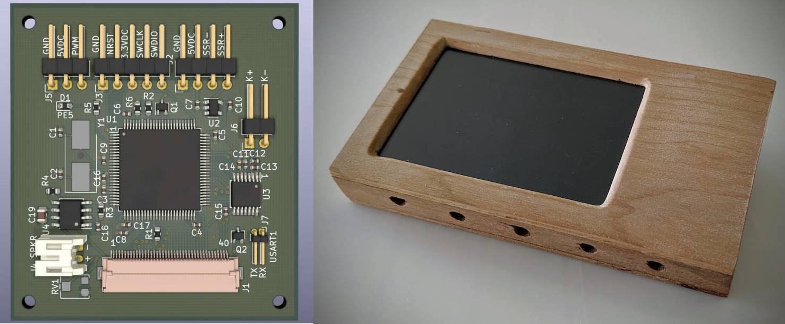

# Bake-n-Flow



## Yet another (STM32F1-based) toaster reflow oven controller - PCB design and firmware

> [!Warning]
> This is personal project. It was built and works without issue for my purposes. It is made public here in case some part of it is useful to others, but **neither the hardware nor firmware have been rigorously tested**.

**Features:**

- Customizable profiles
- Reflow / baking operations
- Manual override controls
- Touch screen control

**This repo contains the firmware and PCB design.**

**See [custom electronics projects at duk.io](https://www.duk.io/blog/electronics-projects/) for full project details.**

https://github.com/canardos/bake-n-flow/assets/14832310/401d4c1e-f360-4829-90d8-4b5ea61bf341

## Build

The project uses the [PlatformIO](https://platformio.org/) dependency management/build system. If you have PlatformIO installed, executing the `run` command in the root folder *should* 🙏 be all that is required for a successful build. The `platformio.ini` file contains the required configuration and PlatformIO will download the required platform dependencies and toolchain.

**1. Clone repo and download submodules**

```shell
> git clone https://github.com/canardos/bake-n-flow.git
> cd bake-n-flow
> git submodule update --init
```

**2. Build firmware (PlatformIO must be installed)**

```shell
> pio run

Processing release (platform: ststm32; board: genericSTM32F103VD; framework: cmsis)
----------------------------------------------------------------------------------------
Verbose mode can be enabled via `-v, --verbose` option
CONFIGURATION: https://docs.platformio.org/page/boards/ststm32/genericSTM32F103VD.html
PLATFORM: ST STM32 (9.0.0) > STM32F103VD (64k RAM. 384k Flash)
HARDWARE: STM32F103VDT6 72MHz, 64KB RAM, 384KB Flash
DEBUG: Current (stlink) External (blackmagic, jlink, stlink)
PACKAGES:
 - framework-cmsis 2.50501.200527 (5.5.1)
 - framework-cmsis-stm32f1 4.3.1
 - tool-ldscripts-ststm32 0.1.0
 - toolchain-gccarmnoneeabi 1.90201.191206 (9.2.1)
LDF: Library Dependency Finder -> http://bit.ly/configure-pio-ldf
LDF Modes: Finder ~ chain, Compatibility ~ soft
Found 4 compatible libraries
Scanning dependencies...
Dependency Graph
|-- <libpekin>
|-- <libpekin_stm32>
|   |-- <libpekin>
Building in release mode
Checking size piobuild/build/release/firmware.elf
Advanced Memory Usage is available via "PlatformIO Home > Project Inspect"
RAM:   [========= ]  94.6% (used 62004 bytes from 65536 bytes)
Flash: [=====     ]  50.5% (used 198664 bytes from 393216 bytes)
============================= [SUCCESS] Took 1.22 seconds =============================
```

**3. Upload to device**

Similarly, use `pio run --target upload` to upload the firmware to the device. You'll likely need to update the upload settings in `platformio.ini` to reflect your settings, or use your own upload tool.

```shell
> pio run --target upload

Configuring upload protocol...
AVAILABLE: blackmagic, dfu, jlink, serial, stlink
CURRENT: upload_protocol = stlink
Uploading piobuild/build/release/firmware.elf
xPack OpenOCD, x86_64 Open On-Chip Debugger 0.10.0+dev-00378-ge5be992df (2020-06-26-09:27)
Licensed under GNU GPL v2
For bug reports, read
        http://openocd.org/doc/doxygen/bugs.html
debug_level: 1

hla_swd
target halted due to debug-request, current mode: Thread
xPSR: 0x01000000 pc: 0x0800108c msp: 0x20010000
** Programming Started **
** Programming Finished **
** Verify Started **
** Verified OK **
** Resetting Target **
shutdown command invoked
======================== [SUCCESS] Took 12.58 seconds =================================
```

**4. [optional] Create project files for IDE**

If you want to view/edit the project in your favorite IDE, use PlatformIO to generate the appropriate setup/workspace files and then import the project in the IDE:

```shell
> pio project init --ide [atom|clion|codeblocks|eclipse|emacs|netbeans|qtcreator|sublimetext|vim|visualstudio|vscode]
```

See the [PlatformIO documentation](https://docs.platformio.org) for further details.

### Using an alternate build system

**Platform dependencies**

If you wish to use a different build system, you will need:

| | |
|-|-|
| ST STM32 CMSIS headers | Peripheral/register definitions |
| CMSIS headers/source | CMSIS HAL functionality - SysTick_Config, NVIC_xxx etc.|
| CMSIS Cortex-M3 system source | `SystemInit()`/`SystemCoreClockUpdate()` implementation and `SystemCoreClock`|
| Startup source file | ASM file containing the startup code and vector table |
| Linker script | Tells the linker how to setup everything in flash/SRAM |

All of these are available in the [STM32 SDK](https://www.st.com/en/development-tools/stm32-software-development-tools.html) available from ST Micro.

**Compiling / linking**

`platformio.ini` lists the required compiler flags. Be sure to use `--specs=nano.specs` and `--specs=nosys.specs` when linking using your own tools, as the standard lib is be too large and is not used.

### Compiler

The project was compiled and tested with `gcc-arm-none-eabi 9.2.1` It should work with any later GCC version and possibly with other compilers. The code contains some GCC flags and some C99 VLAs.

### Target requirements

| | |
|-|-|
|MCU  | STM32F103 with FSMC |
|Flash| >197kb              |
|SRAM | >61kb               |

It may be possible to get by with less SRAM by using a smaller drawing buffer (currently 40 lines - 38.4 kb)

## Dependencies

**CMSIS**

PlatformIO should automatically include/link the correct headers/sources from the STM32 SDK.

**LVGL**

[LVGL](https://github.com/lvgl/lvgl) v5.3 (git commit `9f216a55be65ec05c477ac55f73a6efad50f7680`) is used. It is included as a Git submodule in the`src/lvgl` folder.

**Libpekin**

[Libpekin](https://github.com/canardos/libpekin) is a collection of shared MCU-related code resulting from this and other projects. It's included as a Git submodule in the `lib` folder. PlatformIO will include the `lib` subfolders automatically.

## Hardware - PCB

The PCB was designed with KiCad v.5, but the files have been upgraded to v.7 and are located in `/hardware/pcb`. Gerber output for the first and only revision is located in `/hardware/pcb/plots`.

See the [KiCad documentation](https://docs.kicad.org/) for information on installing and using KiCad.

## Folder structure

```
BakeNFlow
|
+--hardware          | KiCad schematic and board design files
|
+--lib
|  |
|  +--libpekin       | Libpekin platform independent code
|  +--libpekin_stm32 | Libpekin STM32 specific code
|
+--src
|  |
|  +--audio_samples  | Audio sample data
|  +--devices        | Hardware device drivers
|  +--lvgl           | LVGL project
|  +--lvgl_driver    | Display/touch driver for LVGL
|  +--oven           | Oven hardware interface and state management
|  +--reflow         | Reflow data structures and state management
|  +--hal            | (exception handlers etc.)
|  +--ui             | UI code for LVGL
|
|--test              | No tests in use
```

## License

This software is available under the [MIT license](https://opensource.org/license/MIT).
